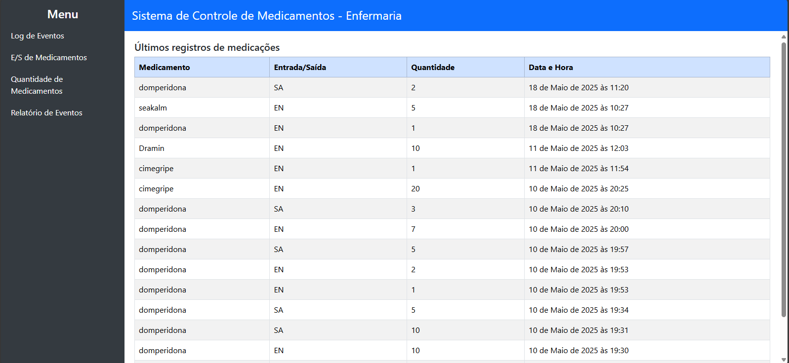
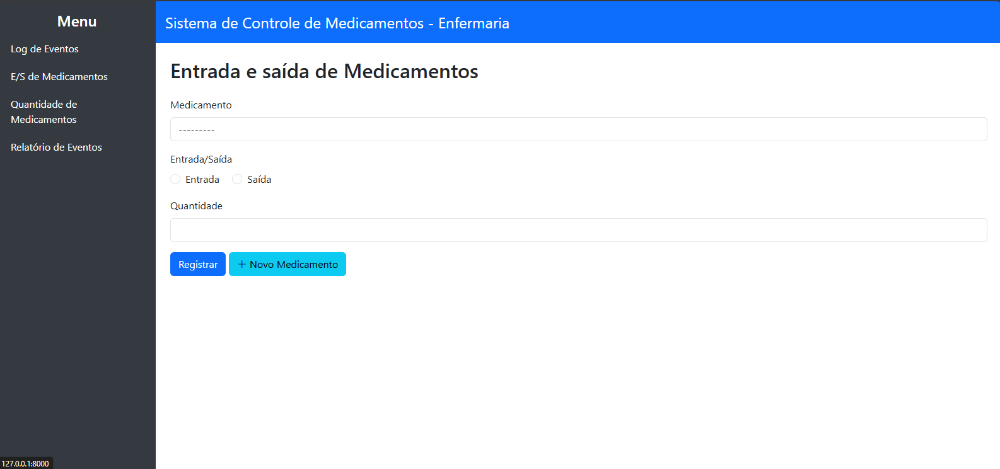

# 💊 Medicines Control
A simple Django-based web application for managing and tracking medication inventory.
It allows users to register new medications, control entries and exits, and view a log of recent stock events.

## 🚀 Features
📦 Register new medications

➕ Add or ➖ remove medication quantities from stock

🕒 View a log of recent stock events

✅ Validations to prevent inconsistent entries

🖥️ User-friendly interface built with Bootstrap


## 📸 Screenshots
### 1. 🏠 Main Screen – Event Log
The main screen displays the latest medication events (entries and exits):


### 2. 🔄 Medication In/Out
Register new medications and control stock changes (entry or exit):



## 🛠️ Technologies Used
- Python 3

- Django 4

- SQLite (default, can be changed to PostgreSQL or MySQL)

- Bootstrap 5

- HTML/CSS

- JavaScript (basic usage)

## ⚙️ Setup Instructions
### 1. Clone the repository
```bash
git clone https://github.com/luiz-oberto/medicines-control.git
cd medicines-control
```

### 2. Create and activate a virtual environment
```bash
python -m venv venv
source venv/bin/activate   
# On Windows use: venv\Scripts\activate
```

### 3. Install dependencies
```bash
pip install -r requirements.txt
```

### 4. Apply migrations
```bash
python manage.py migrate
```

### 5. Run the development server
```bash
python manage.py runserver
```

## 📂 Project Structure
```bash
medicines-control/
├── app/                 # Core Django app (models, views, forms, etc.)
├── templates/           # HTML templates
├── static/              # Static files (CSS, JS)
├── db.sqlite3           # Default SQLite database
├── manage.py
└── README.md
```

## 📌 Future Improvements
- User authentication and permissions

- Export logs to Excel or PDF

- Search/filter by date or medication

- REST API for integrations

## 🧑‍💻 Author
Made by [Luiz Oberto](https://github.com/luiz-oberto)

## 📃 License
This project is open-source and available under the MIT License.